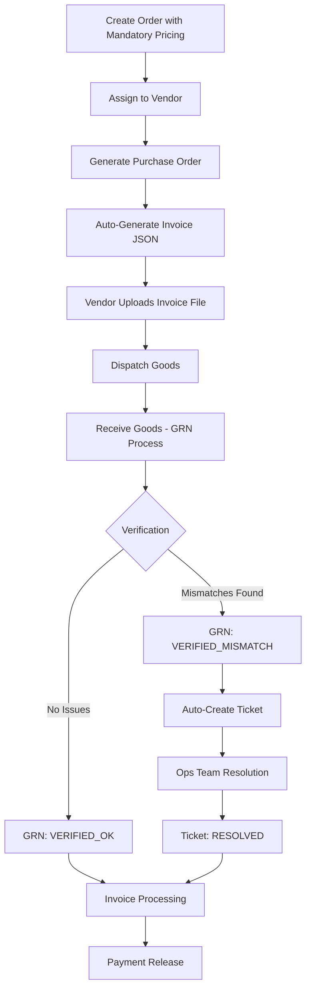

# Kyari OMS - Invoice-Driven Order Flow API Documentation

## Overview

This document provides comprehensive documentation for the enhanced Kyari Order Management System with invoice-driven workflows, mandatory pricing validation, automated invoice generation, file upload capabilities, and GRN auto-ticketing system.

## Table of Contents

- [Authentication](#authentication)
- [Order Management (Enhanced)](#order-management-enhanced)
- [Invoice Generation API](#invoice-generation-api)
- [Invoice Upload System](#invoice-upload-system)
- [GRN Auto-Ticketing System](#grn-auto-ticketing-system)
- [Complete Workflow](#complete-workflow)
- [Error Handling](#error-handling)
- [Status Codes & Enums](#status-codes--enums)

---

## Authentication

All API endpoints require authentication using JWT tokens.

### Headers Required
```
Authorization: Bearer <access_token>
Content-Type: application/json
```

### Login Endpoints

#### POST `/api/auth/login`
Authenticate user and receive access token.

**Request Body:**
```json
{
  "email": "user@example.com",
  "password": "password123"
}
```

**Response:**
```json
{
  "success": true,
  "message": "Login successful",
  "data": {
    "accessToken": "jwt_token_here",
    "user": {
      "id": "user_id",
      "email": "user@example.com",
      "roles": ["ADMIN", "VENDOR", "ACCOUNTS", "OPS"]
    }
  }
}
```

---

## Order Management (Enhanced)

Enhanced order management with **mandatory pricing validation** for all order items.

### Create Order with Mandatory Pricing

#### POST `/api/orders`

**Features:**
- ✅ **Mandatory `pricePerUnit`** for all order items
- ✅ Automatic total calculation
- ✅ Validation ensures no order item missing pricing
- ✅ Enhanced order tracking with financial data

**Request Body:**
```json
{
  "customerInfo": {
    "name": "Customer Name",
    "email": "customer@example.com",
    "phone": "+91-9876543210"
  },
  "deliveryAddress": {
    "street": "123 Main Street",
    "city": "Bangalore",
    "state": "Karnataka",
    "pincode": "560001",
    "landmark": "Near Mall"
  },
  "items": [
    {
      "productName": "Organic Tomatoes",
      "sku": "ORG-TOM-001",
      "quantity": 50,
      "pricePerUnit": 45.00  // ⚠️ MANDATORY FIELD
    },
    {
      "productName": "Fresh Spinach",
      "sku": "FRS-SPN-002",
      "quantity": 30,
      "pricePerUnit": 25.00  // ⚠️ MANDATORY FIELD
    }
  ],
  "source": "API",
  "notes": "Special delivery instructions"
}
```

**Response:**
```json
{
  "success": true,
  "message": "Order created successfully",
  "data": {
    "id": "order_id",
    "orderNumber": "ORD-2024-001",
    "totalAmount": 3000.00,  // Auto-calculated
    "status": "RECEIVED",
    "items": [
      {
        "id": "item_id_1",
        "productName": "Organic Tomatoes",
        "quantity": 50,
        "pricePerUnit": 45.00,
        "totalPrice": 2250.00
      }
    ],
    "createdAt": "2024-10-08T10:30:00Z"
  }
}
```

**Validation Rules:**
- `pricePerUnit` is **required** for all items
- `pricePerUnit` must be > 0
- Automatic `totalPrice` calculation per item
- Order-level `totalAmount` auto-calculated

### List Orders

#### GET `/api/orders`

**Query Parameters:**
- `page` (optional): Page number (default: 1)
- `limit` (optional): Items per page (default: 20)
- `status` (optional): Filter by order status
- `startDate` (optional): Filter orders from date
- `endDate` (optional): Filter orders to date

**Response:**
```json
{
  "success": true,
  "data": {
    "orders": [...],
    "pagination": {
      "currentPage": 1,
      "totalPages": 5,
      "totalItems": 100,
      "itemsPerPage": 20
    }
  }
}
```

### Get Order Details

#### GET `/api/orders/{orderId}`

**Response:**
```json
{
  "success": true,
  "data": {
    "id": "order_id",
    "orderNumber": "ORD-2024-001",
    "status": "ASSIGNED",
    "totalAmount": 3000.00,
    "items": [...],
    "customerInfo": {...},
    "deliveryAddress": {...},
    "assignedItems": [...],  // Vendor assignments
    "createdAt": "2024-10-08T10:30:00Z"
  }
}
```

---

## Invoice Generation API

Automated invoice generation system with JSON templates, S3 storage, and invoice numbering.

### Generate Invoice

#### POST `/api/invoices/generate`

**Features:**
- ✅ Automated JSON invoice generation
- ✅ Sequential invoice numbering
- ✅ S3 storage with presigned URLs
- ✅ Template-based invoice formatting
- ✅ Vendor-specific invoice series

**Request Body:**
```json
{
  "purchaseOrderId": "po_id_here"
}
```

**Response:**
```json
{
  "success": true,
  "message": "Invoice generated successfully",
  "data": {
    "id": "invoice_id",
    "invoiceNumber": "INV-VEN001-2024-001",
    "invoiceDate": "2024-10-08T10:30:00Z",
    "invoiceAmount": 3000.00,
    "status": "PENDING_VERIFICATION",
    "purchaseOrderId": "po_id",
    "attachmentId": "attachment_id",
    "s3Details": {
      "key": "generated-invoices/INV-VEN001-2024-001.json",
      "url": "https://s3.amazonaws.com/bucket/path",
      "presignedUrl": "https://s3.amazonaws.com/presigned-url"
    },
    "createdAt": "2024-10-08T10:30:00Z"
  }
}
```

**Generated Invoice JSON Structure:**
```json
{
  "invoice": {
    "number": "INV-VEN001-2024-001",
    "date": "2024-10-08",
    "dueDate": "2024-11-07",
    "vendor": {
      "name": "Vendor Name",
      "email": "vendor@example.com",
      "address": "Vendor Address"
    },
    "purchaseOrder": {
      "number": "PO-2024-001",
      "date": "2024-10-05"
    },
    "items": [
      {
        "description": "Organic Tomatoes",
        "quantity": 50,
        "unitPrice": 45.00,
        "totalPrice": 2250.00
      }
    ],
    "summary": {
      "subtotal": 3000.00,
      "tax": 540.00,
      "total": 3540.00
    }
  }
}
```

### List Invoices

#### GET `/api/invoices`

**Query Parameters:**
- `page`, `limit`: Pagination
- `status`: Filter by invoice status
- `vendorId`: Filter by vendor
- `startDate`, `endDate`: Date range filter

### Get Invoice Details

#### GET `/api/invoices/{invoiceId}`

### Download Invoice

#### GET `/api/invoices/{invoiceId}/download`

Downloads the generated JSON invoice file.

---

## Invoice Upload System

Multi-channel invoice upload system supporting both vendor and accounts team uploads.

### Upload Invoice to Existing Invoice Record

#### POST `/api/invoices/{invoiceId}/upload`

**Features:**
- ✅ Role-based access control (VENDOR/ACCOUNTS)
- ✅ File validation (PDF, images, documents)
- ✅ S3 storage with organized folders
- ✅ Audit logging for compliance
- ✅ Vendor authorization validation

**Request (Multipart Form Data):**
```
invoice: [FILE] (PDF/Image/Document)
invoiceType: "VENDOR_UPLOAD" | "ACCOUNTS_UPLOAD"
notes: "Optional upload notes"
```

**Response:**
```json
{
  "success": true,
  "message": "Invoice file uploaded successfully",
  "data": {
    "attachment": {
      "id": "attachment_id",
      "fileName": "vendor-invoice.pdf",
      "fileSize": 2048576,
      "uploadedAt": "2024-10-08T10:30:00Z"
    },
    "invoice": {
      "id": "invoice_id",
      "invoiceNumber": "INV-VEN001-2024-001",
      "status": "PENDING_VERIFICATION"
    }
  }
}
```

### Upload and Link Invoice to Purchase Order

#### POST `/api/invoices/upload-and-link`

**Features:**
- ✅ Creates new invoice record
- ✅ Links to existing purchase order
- ✅ Vendor authorization validation
- ✅ Automatic status tracking

**Request (Multipart Form Data):**
```
invoice: [FILE]
invoiceType: "VENDOR_UPLOAD" | "ACCOUNTS_UPLOAD"
invoiceNumber: "VEN-INV-001"
purchaseOrderId: "po_id_here"
notes: "Optional notes"
```

**Response:**
```json
{
  "success": true,
  "message": "Invoice uploaded and linked successfully",
  "data": {
    "invoice": {
      "id": "new_invoice_id",
      "invoiceNumber": "VEN-INV-001",
      "purchaseOrderId": "po_id",
      "status": "PENDING_VERIFICATION"
    },
    "attachment": {
      "id": "attachment_id",
      "fileName": "vendor-invoice.pdf",
      "fileSize": 1024000,
      "uploadedAt": "2024-10-08T10:30:00Z"
    }
  }
}
```

### Get Uploaded Invoices

#### GET `/api/invoices/uploads`

**Features:**
- ✅ Role-based filtering (vendors see only their invoices)
- ✅ Status-based filtering
- ✅ Pagination support

**Query Parameters:**
- `page`, `limit`: Pagination
- `status`: Filter by invoice status
- `purchaseOrderId`: Filter by specific PO

**Response:**
```json
{
  "success": true,
  "message": "Uploaded invoices retrieved successfully",
  "data": {
    "invoices": [
      {
        "id": "invoice_id",
        "invoiceNumber": "VEN-INV-001",
        "status": "PENDING_VERIFICATION",
        "purchaseOrder": {
          "poNumber": "PO-2024-001",
          "vendor": {
            "name": "Vendor Name"
          }
        },
        "attachment": {
          "fileName": "invoice.pdf",
          "uploadedAt": "2024-10-08T10:30:00Z"
        }
      }
    ],
    "pagination": {
      "currentPage": 1,
      "totalPages": 3,
      "totalItems": 50
    }
  }
}
```

**Access Control:**
- **VENDOR**: Can only see their own invoices
- **ACCOUNTS**: Can see all invoices
- **OPS**: Can see all invoices for verification

---

## GRN Auto-Ticketing System

Automated ticket creation system for goods receipt mismatches with intelligent prioritization.

### Get Pending GRNs

#### GET `/api/grn/pending`

**Features:**
- ✅ Lists all GRNs awaiting verification
- ✅ Includes dispatch and vendor details
- ✅ Pagination support

**Response:**
```json
{
  "success": true,
  "message": "Pending GRNs retrieved successfully",
  "data": {
    "grns": [
      {
        "id": "grn_id",
        "grnNumber": "GRN-2024-001",
        "status": "PENDING_VERIFICATION",
        "receivedAt": "2024-10-08T09:00:00Z",
        "dispatch": {
          "dispatchNumber": "DSP-2024-001",
          "vendor": {
            "name": "Vendor Name",
            "user": {
              "email": "vendor@example.com"
            }
          }
        },
        "items": [
          {
            "assignedQuantity": 100,
            "confirmedQuantity": 100,
            "assignedOrderItem": {
              "orderItem": {
                "productName": "Organic Tomatoes"
              }
            }
          }
        ]
      }
    ],
    "pagination": {...}
  }
}
```

### Process GRN Verification with Auto-Ticketing

#### POST `/api/grn/verify`

**Features:**
- ✅ **Automated ticket creation** for mismatches
- ✅ **Intelligent priority assignment** based on severity
- ✅ **Detailed mismatch categorization**
- ✅ **Audit trail** with complete context

**Request Body:**
```json
{
  "goodsReceiptNoteId": "grn_id",
  "grnNumber": "GRN-2024-001",
  "dispatchId": "dispatch_id",
  "operatorRemarks": "Verification completed with discrepancies",
  "mismatches": [
    {
      "grnItemId": "grn_item_id_1",
      "assignedOrderItemId": "assigned_order_item_id_1",
      "assignedQuantity": 100,
      "confirmedQuantity": 100,
      "receivedQuantity": 95,
      "discrepancyQuantity": -5,
      "status": "QUANTITY_MISMATCH",
      "itemRemarks": "5 units missing from shipment",
      "damageReported": false
    },
    {
      "grnItemId": "grn_item_id_2",
      "assignedOrderItemId": "assigned_order_item_id_2",
      "assignedQuantity": 50,
      "confirmedQuantity": 50,
      "receivedQuantity": 45,
      "discrepancyQuantity": -5,
      "status": "DAMAGE_REPORTED",
      "itemRemarks": "Units damaged during transit",
      "damageReported": true,
      "damageDescription": "Crushed packaging, items unusable"
    }
  ]
}
```

**Response:**
```json
{
  "success": true,
  "message": "GRN verified with mismatches. Ticket TKT-202410-001 created automatically.",
  "data": {
    "grn": {
      "id": "grn_id",
      "grnNumber": "GRN-2024-001",
      "status": "VERIFIED_MISMATCH",
      "verifiedAt": "2024-10-08T10:30:00Z"
    },
    "ticket": {
      "id": "ticket_id",
      "ticketNumber": "TKT-202410-001",
      "title": "GRN Mismatch - GRN-2024-001 (PO-2024-001)",
      "priority": "HIGH",
      "status": "OPEN"
    },
    "mismatches": 2,
    "message": "GRN verified with mismatches. Ticket TKT-202410-001 created automatically."
  }
}
```

**Priority Assignment Logic:**
- **URGENT**: Damage reported OR discrepancy > 100 units
- **HIGH**: Critical discrepancy > 50 units
- **MEDIUM**: Standard quantity mismatches
- **LOW**: Excess received items only

**Mismatch Status Types:**
- `VERIFIED_OK`: No issues
- `QUANTITY_MISMATCH`: Received quantity ≠ expected
- `DAMAGE_REPORTED`: Items damaged during transit
- `SHORTAGE_REPORTED`: Items missing from shipment
- `EXCESS_RECEIVED`: More items than expected

### Get GRN Details

#### GET `/api/grn/{grnId}`

**Response:**
```json
{
  "success": true,
  "data": {
    "id": "grn_id",
    "grnNumber": "GRN-2024-001",
    "status": "VERIFIED_MISMATCH",
    "operatorRemarks": "Verification completed with discrepancies",
    "verifiedAt": "2024-10-08T10:30:00Z",
    "dispatch": {...},
    "items": [...],
    "ticket": {
      "id": "ticket_id",
      "ticketNumber": "TKT-202410-001",
      "title": "GRN Mismatch - GRN-2024-001",
      "status": "OPEN",
      "priority": "HIGH",
      "comments": [...]
    },
    "verifiedBy": {
      "id": "user_id",
      "email": "ops@kyari.com"
    }
  }
}
```

### Get Ticket by GRN

#### GET `/api/grn/{grnId}/ticket`

**Response:**
```json
{
  "success": true,
  "data": {
    "id": "ticket_id",
    "ticketNumber": "TKT-202410-001",
    "title": "GRN Mismatch - GRN-2024-001 (PO-2024-001)",
    "description": "AUTOMATED TICKET: GRN Verification Mismatch Detected\n\nGRN Details:\n- GRN Number: GRN-2024-001\n- PO Number: PO-2024-001\n- Vendor: vendor@example.com\n- Verified At: 2024-10-08T10:30:00Z\n\nMismatches Identified:\n1. Organic Tomatoes:\n   - Assigned: 100\n   - Confirmed: 100\n   - Received: 95\n   - Discrepancy: -5\n   - Status: QUANTITY_MISMATCH\n   - Remarks: 5 units missing from shipment\n\nAction Required:\n- Vendor coordination for discrepancies\n- Update inventory records if needed\n- Consider credit note or adjustment invoice\n- Document resolution for audit trail",
    "status": "OPEN",
    "priority": "HIGH",
    "goodsReceiptNote": {...},
    "createdBy": {...},
    "assignee": null,
    "comments": [
      {
        "id": "comment_id",
        "content": "GRN Verification completed with the following issues:\n\nQUANTITY_MISMATCH: 1 item(s)\n  - Discrepancy: -5 units\n    Remarks: 5 units missing from shipment\n\nDAMAGE_REPORTED: 1 item(s)\n  - Discrepancy: -5 units\n    Remarks: Units damaged during transit\n\nTotal items with issues: 2\nRequires vendor coordination and resolution.",
        "user": {
          "email": "ops@kyari.com"
        },
        "createdAt": "2024-10-08T10:30:00Z"
      }
    ],
    "attachments": [],
    "createdAt": "2024-10-08T10:30:00Z"
  }
}
```

### Update Ticket Status

#### PATCH `/api/grn/tickets/{ticketId}/status`

**Request Body:**
```json
{
  "status": "IN_PROGRESS",
  "comment": "Started investigating the quantity mismatch with vendor"
}
```

**Response:**
```json
{
  "success": true,
  "message": "Ticket status updated to IN_PROGRESS",
  "data": {
    "ticket": {
      "id": "ticket_id",
      "ticketNumber": "TKT-202410-001",
      "status": "IN_PROGRESS",
      "resolvedAt": null
    }
  }
}
```

**Ticket Status Flow:**
```
OPEN → IN_PROGRESS → RESOLVED → CLOSED
```

---

## Complete Workflow

### End-to-End Invoice-Driven Order Flow



### Step-by-Step Process

1. **Order Creation** (Enhanced with Mandatory Pricing)
   ```bash
   POST /api/orders
   # ✅ pricePerUnit required for all items
   # ✅ Automatic total calculation
   ```

2. **Vendor Assignment & PO Generation**
   ```bash
   # Existing vendor assignment process
   # PO generated with all pricing information
   ```

3. **Invoice Generation**
   ```bash
   POST /api/invoices/generate
   # ✅ Automated JSON invoice creation
   # ✅ S3 storage with presigned URLs
   ```

4. **Invoice Upload**
   ```bash
   POST /api/invoices/upload-and-link
   # ✅ Vendor uploads their invoice
   # ✅ Role-based access control
   ```

5. **Goods Receipt & Verification**
   ```bash
   POST /api/grn/verify
   # ✅ Operations team verifies received goods
   # ✅ Auto-ticket creation for mismatches
   ```

6. **Ticket Resolution**
   ```bash
   PATCH /api/grn/tickets/{ticketId}/status
   # ✅ Track resolution progress
   # ✅ Vendor coordination and documentation
   ```

7. **Invoice Processing & Payment**
   ```bash
   # Final approval and payment release
   # Complete audit trail maintained
   ```

---

## Error Handling

### Standard Error Response Format

```json
{
  "success": false,
  "error": "Error message",
  "errors": {
    "field_name": ["Validation error message"]
  }
}
```

### Common HTTP Status Codes

- `200`: Success
- `201`: Created successfully
- `400`: Bad Request (validation errors)
- `401`: Unauthorized (missing/invalid token)
- `403`: Forbidden (insufficient permissions)
- `404`: Not Found
- `422`: Validation Error
- `500`: Internal Server Error

### Validation Errors

#### Missing Mandatory Pricing
```json
{
  "success": false,
  "error": "Validation failed",
  "errors": {
    "items.0.pricePerUnit": ["Price per unit is required"]
  }
}
```

#### Invalid File Upload
```json
{
  "success": false,
  "error": "Invalid file type. Only PDF, images, and document files are allowed."
}
```

#### Access Control Violations
```json
{
  "success": false,
  "error": "You can only upload invoices for your own orders"
}
```

---

## Status Codes & Enums

### Order Status
- `RECEIVED`: Order received and pending assignment
- `ASSIGNED`: Assigned to vendor(s)
- `PROCESSING`: Being processed by vendor
- `FULFILLED`: All items fulfilled
- `PARTIALLY_FULFILLED`: Some items fulfilled
- `CLOSED`: Order completed
- `CANCELLED`: Order cancelled

### Invoice Status
- `PENDING_VERIFICATION`: Awaiting verification
- `VERIFIED`: Verified and approved
- `REJECTED`: Rejected due to discrepancies
- `PAID`: Payment completed

### GRN Status
- `PENDING_VERIFICATION`: Awaiting verification
- `VERIFIED_OK`: Verified without issues
- `VERIFIED_MISMATCH`: Verified with mismatches
- `PARTIALLY_VERIFIED`: Partially verified

### GRN Item Status
- `VERIFIED_OK`: No issues
- `QUANTITY_MISMATCH`: Quantity discrepancy
- `DAMAGE_REPORTED`: Damage reported
- `SHORTAGE_REPORTED`: Items missing
- `EXCESS_RECEIVED`: Extra items received

### Ticket Status
- `OPEN`: Newly created ticket
- `IN_PROGRESS`: Being actively worked on
- `RESOLVED`: Issue resolved
- `CLOSED`: Ticket closed

### Ticket Priority
- `LOW`: Minor issues (excess items)
- `MEDIUM`: Standard mismatches
- `HIGH`: Significant discrepancies
- `URGENT`: Critical issues (damage, large shortages)

---

## Authentication & Authorization

### Role-Based Access Control

| Role | Order Management | Invoice Generation | Invoice Upload | GRN Verification |
|------|------------------|-------------------|----------------|------------------|
| **ADMIN** | ✅ Full Access | ✅ Full Access | ✅ Full Access | ✅ Full Access |
| **VENDOR** | ❌ Read Own | ❌ No Access | ✅ Own Invoices | ❌ No Access |
| **ACCOUNTS** | ✅ Read All | ✅ Generate | ✅ All Invoices | ❌ No Access |
| **OPS** | ✅ Read All | ❌ No Access | ✅ Read All | ✅ Full Access |

### API Rate Limits

- **File Uploads**: 10 requests per minute
- **Standard APIs**: 100 requests per minute
- **Bulk Operations**: 5 requests per minute

---

This documentation provides comprehensive coverage of the enhanced invoice-driven order flow system with all new features and capabilities.