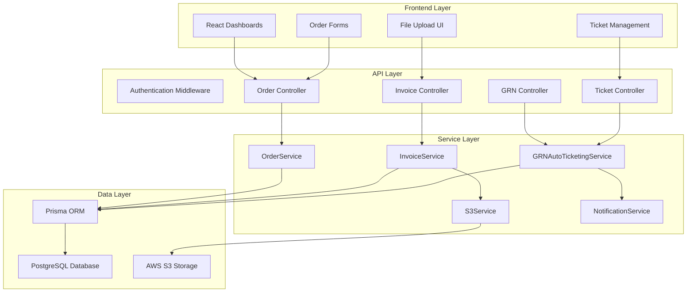
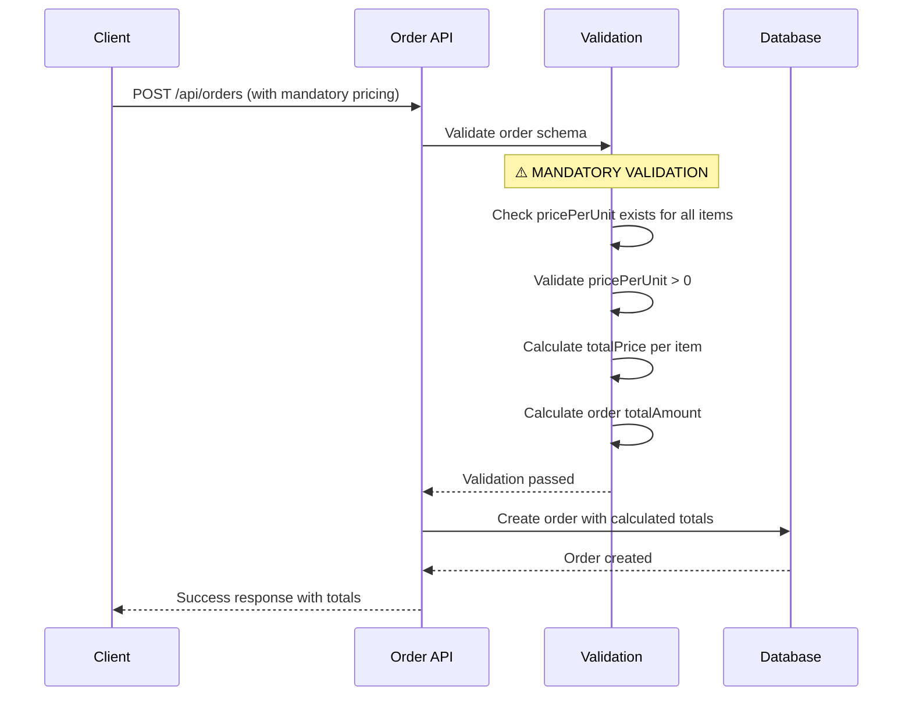
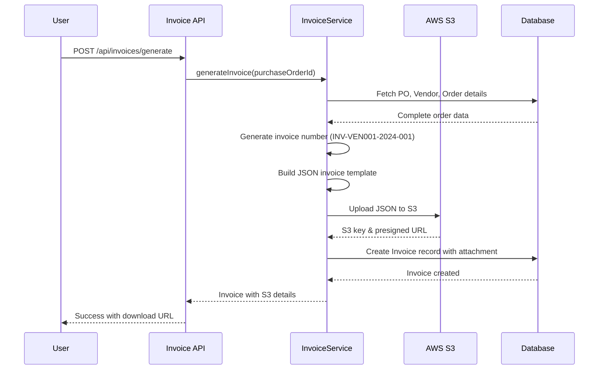
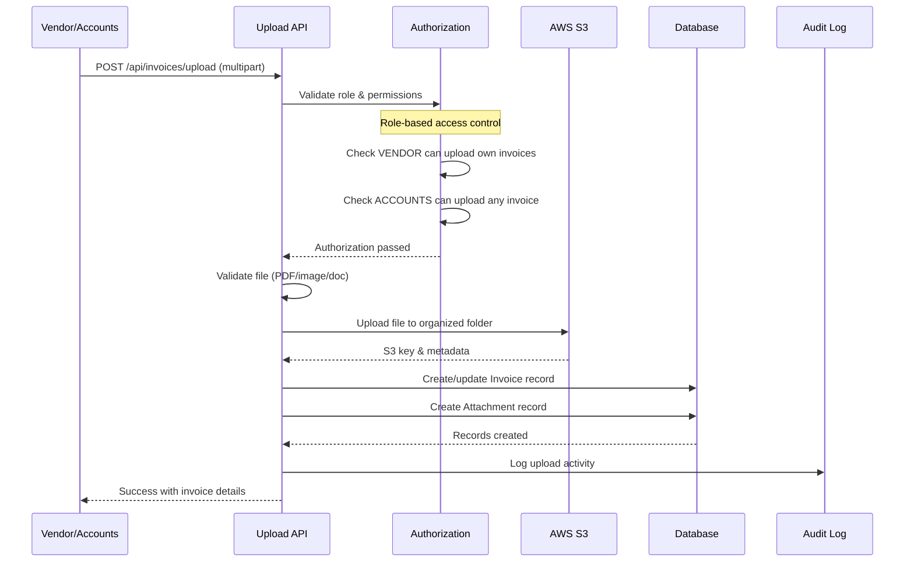
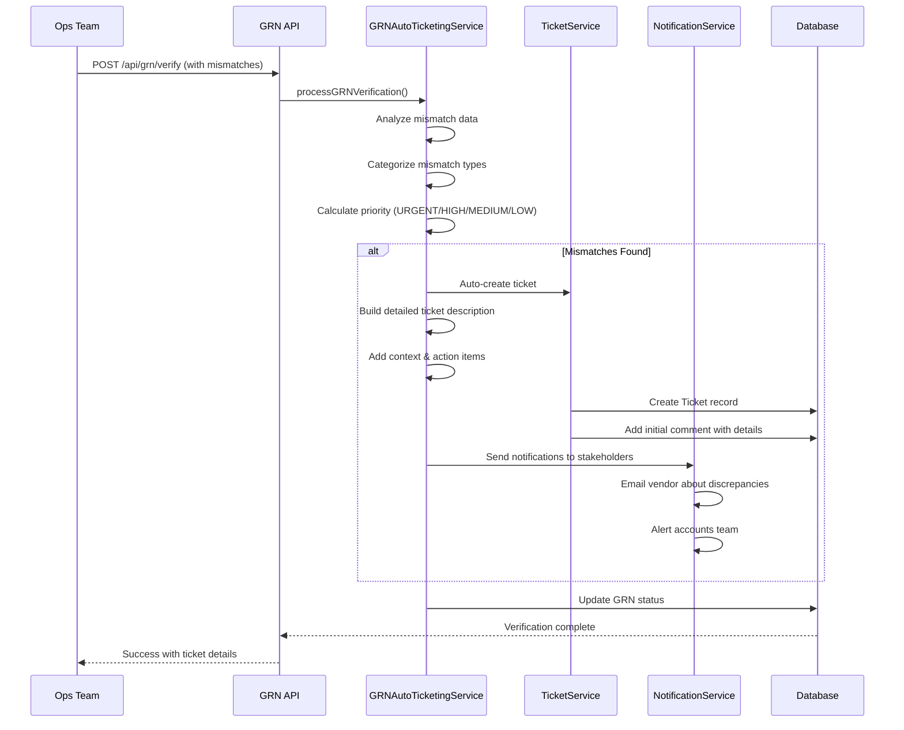

# Kyari OMS - Invoice-Driven Order Flow Technical Documentation

## Architecture Overview

This document provides detailed technical specifications for the enhanced Kyari Order Management System (OMS) with invoice-driven workflows, mandatory pricing validation, automated invoice generation, and GRN auto-ticketing system.

## Table of Contents

- [System Architecture](#system-architecture)
- [Database Schema](#database-schema)
- [Business Logic Flow](#business-logic-flow)
- [Technical Implementation](#technical-implementation)
- [Integration Points](#integration-points)
- [Performance Considerations](#performance-considerations)
- [Security & Compliance](#security--compliance)

---

## System Architecture

### High-Level Architecture

```
┌─────────────────┐    ┌─────────────────┐    ┌─────────────────┐
│   Frontend      │    │   Backend API   │    │   External      │
│   React App     │◄──►│   Node.js       │◄──►│   Services      │
│                 │    │   Express       │    │                 │
│   - Dashboards  │    │   TypeScript    │    │   - AWS S3      │
│   - Forms       │    │   - Order Mgmt  │    │   - Email       │
│   - File Upload │    │   - Invoice API │    │   - SMS         │
└─────────────────┘    │   - GRN System  │    └─────────────────┘
                       │   - Auto-Ticket │              
                       └─────────────────┘              
                                │                       
                       ┌─────────────────┐              
                       │   Database      │              
                       │   PostgreSQL    │              
                       │   via Prisma    │              
                       └─────────────────┘              
```

### Component Architecture



---

## Database Schema

### Enhanced Order Management Schema

```sql
-- Core Order table with enhanced pricing
model Order {
  id               String    @id @default(cuid())
  orderNumber      String    @unique
  totalAmount      Decimal   @db.Decimal(10,2)  -- Auto-calculated from items
  status           OrderStatus
  source           String
  notes            String?
  customerInfo     Json      -- Structured customer data
  deliveryAddress  Json      -- Structured address data
  createdAt        DateTime  @default(now())
  updatedAt        DateTime  @updatedAt
  
  items            OrderItem[]
  assignedItems    AssignedOrderItem[]
  @@map("orders")
}

-- Order items with MANDATORY pricing
model OrderItem {
  id              String    @id @default(cuid())
  orderId         String
  productName     String
  sku             String?
  quantity        Int
  pricePerUnit    Decimal   @db.Decimal(10,2)  -- ⚠️ MANDATORY FIELD
  totalPrice      Decimal   @db.Decimal(10,2)  -- Auto-calculated
  
  order           Order     @relation(fields: [orderId], references: [id])
  assignedItems   AssignedOrderItem[]
  @@map("order_items")
}
```

### Invoice Management Schema

```sql
-- Enhanced Invoice model for automated generation
model Invoice {
  id                    String         @id @default(cuid())
  invoiceNumber         String         @unique
  invoiceDate           DateTime
  invoiceAmount         Decimal        @db.Decimal(10,2)
  dueDate              DateTime?
  status               InvoiceStatus
  purchaseOrderId      String?
  attachmentId         String?        -- S3 generated JSON
  uploadedAttachmentId String?        -- User uploaded file
  
  purchaseOrder        PurchaseOrder? @relation(fields: [purchaseOrderId], references: [id])
  attachment           Attachment?    @relation("InvoiceAttachment", fields: [attachmentId], references: [id])
  uploadedAttachment   Attachment?    @relation("InvoiceUpload", fields: [uploadedAttachmentId], references: [id])
  @@map("invoices")
}

-- File attachment management
model Attachment {
  id               String      @id @default(cuid())
  fileName         String
  filePath         String      -- S3 key
  fileSize         BigInt
  mimeType         String
  uploadedBy       String
  uploadType       String      -- "GENERATED_INVOICE" | "VENDOR_UPLOAD" | "ACCOUNTS_UPLOAD"
  
  uploadedByUser   User        @relation(fields: [uploadedBy], references: [id])
  generatedInvoices Invoice[]  @relation("InvoiceAttachment")
  uploadedInvoices  Invoice[]  @relation("InvoiceUpload")
  @@map("attachments")
}
```

### GRN & Auto-Ticketing Schema

```sql
-- Goods Receipt Note model
model GoodsReceiptNote {
  id                String            @id @default(cuid())
  grnNumber         String            @unique
  dispatchId        String
  receivedAt        DateTime          @default(now())
  verifiedAt        DateTime?
  verifiedBy        String?
  status            GRNStatus
  operatorRemarks   String?
  
  dispatch          Dispatch          @relation(fields: [dispatchId], references: [id])
  verifiedByUser    User?             @relation(fields: [verifiedBy], references: [id])
  items             GRNItem[]
  ticket            Ticket?           -- Auto-generated ticket for mismatches
  @@map("goods_receipt_notes")
}

-- GRN items with mismatch tracking
model GRNItem {
  id                      String         @id @default(cuid())
  goodsReceiptNoteId      String
  assignedOrderItemId     String
  assignedQuantity        Int            -- Expected quantity
  confirmedQuantity       Int            -- Confirmed by vendor
  receivedQuantity        Int?           -- Actually received
  discrepancyQuantity     Int?           -- Calculated difference
  status                  GRNItemStatus
  itemRemarks             String?
  damageReported          Boolean        @default(false)
  damageDescription       String?
  
  goodsReceiptNote        GoodsReceiptNote      @relation(fields: [goodsReceiptNoteId], references: [id])
  assignedOrderItem       AssignedOrderItem     @relation(fields: [assignedOrderItemId], references: [id])
  @@map("grn_items")
}

-- Auto-generated tickets for GRN mismatches
model Ticket {
  id                    String         @id @default(cuid())
  ticketNumber          String         @unique
  title                 String
  description           String
  status                TicketStatus
  priority              TicketPriority
  goodsReceiptNoteId    String?        @unique
  createdBy             String
  assignee              String?
  resolvedAt            DateTime?
  
  goodsReceiptNote      GoodsReceiptNote? @relation(fields: [goodsReceiptNoteId], references: [id])
  createdByUser         User              @relation("TicketCreatedBy", fields: [createdBy], references: [id])
  assigneeUser          User?             @relation("TicketAssignee", fields: [assignee], references: [id])
  comments              TicketComment[]
  attachments           TicketAttachment[]
  @@map("tickets")
}
```

### Status Enums

```sql
enum OrderStatus {
  RECEIVED
  ASSIGNED
  PROCESSING
  FULFILLED
  PARTIALLY_FULFILLED
  CLOSED
  CANCELLED
}

enum InvoiceStatus {
  PENDING_VERIFICATION
  VERIFIED
  REJECTED
  PAID
}

enum GRNStatus {
  PENDING_VERIFICATION
  VERIFIED_OK
  VERIFIED_MISMATCH
  PARTIALLY_VERIFIED
}

enum GRNItemStatus {
  VERIFIED_OK
  QUANTITY_MISMATCH
  DAMAGE_REPORTED
  SHORTAGE_REPORTED
  EXCESS_RECEIVED
}

enum TicketStatus {
  OPEN
  IN_PROGRESS
  RESOLVED
  CLOSED
}

enum TicketPriority {
  LOW
  MEDIUM
  HIGH
  URGENT
}
```

---

## Business Logic Flow

### 1. Enhanced Order Creation Flow



**Key Validation Rules:**
```typescript
const createOrderItemSchema = z.object({
  productName: z.string().min(1),
  sku: z.string().optional(),
  quantity: z.number().min(1),
  pricePerUnit: z.number().min(0.01), // ⚠️ MANDATORY & > 0
});

// Auto-calculation logic
const totalPrice = quantity * pricePerUnit;
const orderTotalAmount = items.reduce((sum, item) => sum + item.totalPrice, 0);
```

### 2. Automated Invoice Generation Flow



**Invoice Generation Logic:**
```typescript
async generateInvoice(purchaseOrderId: string) {
  // 1. Fetch complete PO data
  const purchaseOrder = await this.fetchPOWithDetails(purchaseOrderId);
  
  // 2. Generate sequential invoice number
  const invoiceNumber = await this.generateInvoiceNumber(purchaseOrder.vendorId);
  
  // 3. Build JSON invoice template
  const invoiceData = {
    invoice: {
      number: invoiceNumber,
      date: new Date().toISOString().split('T')[0],
      dueDate: this.calculateDueDate(30), // 30 days
      vendor: this.formatVendorInfo(purchaseOrder.vendor),
      purchaseOrder: this.formatPOInfo(purchaseOrder),
      items: this.formatInvoiceItems(purchaseOrder.assignedItems),
      summary: this.calculateInvoiceSummary(purchaseOrder.assignedItems)
    }
  };
  
  // 4. Upload to S3
  const s3Key = `generated-invoices/${invoiceNumber}.json`;
  const s3Result = await this.s3Service.uploadBuffer(
    Buffer.from(JSON.stringify(invoiceData, null, 2)),
    s3Key,
    'application/json'
  );
  
  // 5. Create invoice record
  return await this.createInvoiceRecord(invoiceData, s3Result);
}
```

### 3. Invoice Upload System Flow



**Role-based Upload Control:**
```typescript
// Vendor authorization check
if (userRole === 'VENDOR') {
  const vendorPO = await this.validateVendorPOAccess(userId, purchaseOrderId);
  if (!vendorPO) {
    throw new ForbiddenException('You can only upload invoices for your own orders');
  }
}

// File validation
const allowedMimeTypes = [
  'application/pdf',
  'image/jpeg', 'image/png', 'image/webp',
  'application/msword',
  'application/vnd.openxmlformats-officedocument.wordprocessingml.document'
];

// S3 folder organization
const s3Key = `invoice-uploads/${userRole.toLowerCase()}/${fileName}`;
```

### 4. GRN Auto-Ticketing Flow



**Priority Assignment Algorithm:**
```typescript
calculateTicketPriority(mismatches: GRNMismatch[]): TicketPriority {
  let hasDamage = false;
  let maxDiscrepancy = 0;
  let totalShortage = 0;
  
  for (const mismatch of mismatches) {
    if (mismatch.damageReported) hasDamage = true;
    if (mismatch.discrepancyQuantity < 0) {
      totalShortage += Math.abs(mismatch.discrepancyQuantity);
    }
    maxDiscrepancy = Math.max(maxDiscrepancy, Math.abs(mismatch.discrepancyQuantity));
  }
  
  // Priority logic
  if (hasDamage || maxDiscrepancy > 100) return 'URGENT';
  if (maxDiscrepancy > 50 || totalShortage > 100) return 'HIGH';
  if (maxDiscrepancy > 0) return 'MEDIUM';
  return 'LOW';
}
```

**Automated Ticket Content Generation:**
```typescript
generateTicketDescription(grn: GRNData, mismatches: GRNMismatch[]): string {
  const template = `
AUTOMATED TICKET: GRN Verification Mismatch Detected

GRN Details:
- GRN Number: ${grn.grnNumber}
- PO Number: ${grn.dispatch.purchaseOrder.poNumber}
- Vendor: ${grn.dispatch.vendor.user.email}
- Verified At: ${new Date().toISOString()}

Mismatches Identified:
${this.formatMismatchDetails(mismatches)}

Action Required:
- Vendor coordination for discrepancies
- Update inventory records if needed
- Consider credit note or adjustment invoice
- Document resolution for audit trail
  `;
  
  return template.trim();
}
```

---

## Technical Implementation

### 1. Order Service Enhancement

```typescript
// Enhanced OrderService with mandatory pricing
export class OrderService {
  async createOrder(orderData: CreateOrderDTO): Promise<Order> {
    // Validate mandatory pricing
    this.validateMandatoryPricing(orderData.items);
    
    // Calculate totals
    const processedItems = this.calculateItemTotals(orderData.items);
    const totalAmount = this.calculateOrderTotal(processedItems);
    
    // Create order with transaction
    return await this.prisma.$transaction(async (tx) => {
      const order = await tx.order.create({
        data: {
          ...orderData,
          totalAmount,
          items: {
            create: processedItems
          }
        }
      });
      
      return order;
    });
  }
  
  private validateMandatoryPricing(items: CreateOrderItemDTO[]) {
    for (const item of items) {
      if (!item.pricePerUnit || item.pricePerUnit <= 0) {
        throw new BadRequestException(
          `Price per unit is required and must be greater than 0 for item: ${item.productName}`
        );
      }
    }
  }
  
  private calculateItemTotals(items: CreateOrderItemDTO[]) {
    return items.map(item => ({
      ...item,
      totalPrice: item.quantity * item.pricePerUnit
    }));
  }
}
```

### 2. Invoice Service Implementation

```typescript
// Complete InvoiceService with S3 integration
export class InvoiceService {
  constructor(
    private prisma: PrismaService,
    private s3Service: S3Service
  ) {}
  
  async generateInvoice(purchaseOrderId: string): Promise<GeneratedInvoice> {
    // Fetch complete PO data
    const purchaseOrder = await this.fetchPOWithDetails(purchaseOrderId);
    
    // Generate invoice number
    const invoiceNumber = await this.generateInvoiceNumber(purchaseOrder.vendorId);
    
    // Build invoice template
    const invoiceData = this.prepareInvoiceTemplateData(purchaseOrder, invoiceNumber);
    
    // Upload to S3
    const s3Key = `generated-invoices/${invoiceNumber}.json`;
    const buffer = Buffer.from(JSON.stringify(invoiceData, null, 2));
    const s3Result = await this.s3Service.uploadBuffer(buffer, s3Key, 'application/json');
    
    // Create invoice record
    const invoice = await this.prisma.invoice.create({
      data: {
        invoiceNumber,
        invoiceDate: new Date(),
        invoiceAmount: invoiceData.invoice.summary.total,
        dueDate: this.calculateDueDate(30),
        status: 'PENDING_VERIFICATION',
        purchaseOrderId,
        attachment: {
          create: {
            fileName: `${invoiceNumber}.json`,
            filePath: s3Key,
            fileSize: buffer.length,
            mimeType: 'application/json',
            uploadedBy: 'system',
            uploadType: 'GENERATED_INVOICE'
          }
        }
      },
      include: { attachment: true }
    });
    
    return {
      invoice,
      s3Details: s3Result,
      invoiceData
    };
  }
}
```

### 3. GRN Auto-Ticketing Service

```typescript
// Complete GRNAutoTicketingService
export class GRNAutoTicketingService {
  async processGRNVerification(verificationData: GRNVerificationDTO): Promise<GRNVerificationResult> {
    const { goodsReceiptNoteId, mismatches, operatorRemarks } = verificationData;
    
    // Analyze mismatches
    const hasMismatches = mismatches.some(m => m.status !== 'VERIFIED_OK');
    const grnStatus = hasMismatches ? 'VERIFIED_MISMATCH' : 'VERIFIED_OK';
    
    let ticket = null;
    
    await this.prisma.$transaction(async (tx) => {
      // Update GRN status
      const grn = await tx.goodsReceiptNote.update({
        where: { id: goodsReceiptNoteId },
        data: {
          status: grnStatus,
          verifiedAt: new Date(),
          operatorRemarks
        },
        include: {
          dispatch: {
            include: {
              vendor: { include: { user: true } },
              purchaseOrder: true
            }
          }
        }
      });
      
      // Update GRN items
      for (const mismatch of mismatches) {
        await tx.gRNItem.update({
          where: { id: mismatch.grnItemId },
          data: {
            receivedQuantity: mismatch.receivedQuantity,
            discrepancyQuantity: mismatch.discrepancyQuantity,
            status: mismatch.status,
            itemRemarks: mismatch.itemRemarks,
            damageReported: mismatch.damageReported,
            damageDescription: mismatch.damageDescription
          }
        });
      }
      
      // Auto-create ticket if mismatches found
      if (hasMismatches) {
        ticket = await this.generateTicketFromMismatches(tx, grn, mismatches);
      }
    });
    
    return {
      grnStatus,
      ticket,
      mismatches: mismatches.length,
      hasMismatches
    };
  }
  
  private async generateTicketFromMismatches(
    tx: any,
    grn: any,
    mismatches: GRNMismatch[]
  ): Promise<Ticket> {
    const ticketNumber = await this.generateTicketNumber();
    const priority = this.calculateTicketPriority(mismatches);
    const title = this.generateTicketTitle(grn);
    const description = this.generateTicketDescription(grn, mismatches);
    
    const ticket = await tx.ticket.create({
      data: {
        ticketNumber,
        title,
        description,
        status: 'OPEN',
        priority,
        goodsReceiptNoteId: grn.id,
        createdBy: grn.verifiedBy,
        comments: {
          create: {
            content: this.generateInitialComment(mismatches),
            userId: grn.verifiedBy
          }
        }
      }
    });
    
    // Send notifications
    await this.sendMismatchNotifications(grn, ticket, mismatches);
    
    return ticket;
  }
}
```

---

## Integration Points

### 1. AWS S3 Integration

```typescript
// S3Service for file management
export class S3Service {
  private s3Client: S3Client;
  
  constructor() {
    this.s3Client = new S3Client({
      region: process.env.AWS_REGION,
      credentials: {
        accessKeyId: process.env.AWS_ACCESS_KEY_ID!,
        secretAccessKey: process.env.AWS_SECRET_ACCESS_KEY!
      }
    });
  }
  
  async uploadBuffer(
    buffer: Buffer,
    key: string,
    contentType: string
  ): Promise<S3UploadResult> {
    const command = new PutObjectCommand({
      Bucket: process.env.AWS_S3_BUCKET!,
      Key: key,
      Body: buffer,
      ContentType: contentType
    });
    
    await this.s3Client.send(command);
    
    // Generate presigned URL for download
    const presignedUrl = await getSignedUrl(
      this.s3Client,
      new GetObjectCommand({
        Bucket: process.env.AWS_S3_BUCKET!,
        Key: key
      }),
      { expiresIn: 3600 } // 1 hour
    );
    
    return {
      key,
      url: `https://${process.env.AWS_S3_BUCKET}.s3.${process.env.AWS_REGION}.amazonaws.com/${key}`,
      presignedUrl
    };
  }
}
```

### 2. File Upload Middleware

```typescript
// Multer configuration for file uploads
export const invoiceUploadMiddleware = multer({
  storage: multer.memoryStorage(),
  limits: {
    fileSize: 10 * 1024 * 1024, // 10MB limit
  },
  fileFilter: (req, file, cb) => {
    const allowedMimeTypes = [
      'application/pdf',
      'image/jpeg', 'image/png', 'image/webp',
      'application/msword',
      'application/vnd.openxmlformats-officedocument.wordprocessingml.document'
    ];
    
    if (allowedMimeTypes.includes(file.mimetype)) {
      cb(null, true);
    } else {
      cb(new Error('Invalid file type. Only PDF, images, and document files are allowed.'), false);
    }
  }
}).single('invoice');
```

### 3. Authentication Middleware

```typescript
// Enhanced auth middleware with role validation
export const authenticateAndAuthorize = (allowedRoles?: string[]) => {
  return async (req: Request, res: Response, next: NextFunction) => {
    try {
      const token = req.headers.authorization?.replace('Bearer ', '');
      if (!token) {
        return res.status(401).json({ success: false, error: 'Access token required' });
      }
      
      const decoded = jwt.verify(token, process.env.JWT_SECRET!) as any;
      const user = await prisma.user.findUnique({
        where: { id: decoded.userId },
        include: { roles: true }
      });
      
      if (!user) {
        return res.status(401).json({ success: false, error: 'Invalid token' });
      }
      
      // Role-based authorization
      if (allowedRoles && allowedRoles.length > 0) {
        const userRoles = user.roles.map(r => r.role);
        const hasRequiredRole = allowedRoles.some(role => userRoles.includes(role));
        
        if (!hasRequiredRole) {
          return res.status(403).json({ 
            success: false, 
            error: 'Insufficient permissions' 
          });
        }
      }
      
      req.user = user;
      next();
    } catch (error) {
      return res.status(401).json({ success: false, error: 'Invalid token' });
    }
  };
};
```

---

## Performance Considerations

### 1. Database Optimization

```sql
-- Key indexes for performance
CREATE INDEX idx_orders_status ON orders(status);
CREATE INDEX idx_orders_created_at ON orders(created_at);
CREATE INDEX idx_order_items_order_id ON order_items(order_id);
CREATE INDEX idx_invoices_purchase_order_id ON invoices(purchase_order_id);
CREATE INDEX idx_invoices_status ON invoices(status);
CREATE INDEX idx_grn_status ON goods_receipt_notes(status);
CREATE INDEX idx_grn_verified_at ON goods_receipt_notes(verified_at);
CREATE INDEX idx_tickets_status ON tickets(status);
CREATE INDEX idx_tickets_priority ON tickets(priority);
CREATE INDEX idx_tickets_grn_id ON tickets(goods_receipt_note_id);
```

### 2. Caching Strategy

```typescript
// Redis caching for frequently accessed data
export class CacheService {
  private redis: Redis;
  
  async cacheInvoiceTemplate(vendorId: string, template: any) {
    const key = `invoice_template:${vendorId}`;
    await this.redis.setex(key, 3600, JSON.stringify(template)); // 1 hour cache
  }
  
  async getVendorOrderCount(vendorId: string): Promise<number> {
    const cacheKey = `vendor_orders:${vendorId}`;
    const cached = await this.redis.get(cacheKey);
    
    if (cached) return parseInt(cached);
    
    const count = await this.prisma.order.count({
      where: { assignedItems: { some: { vendorId } } }
    });
    
    await this.redis.setex(cacheKey, 300, count.toString()); // 5 min cache
    return count;
  }
}
```

### 3. Async Processing

```typescript
// Queue system for heavy operations
export class QueueService {
  async processInvoiceGeneration(purchaseOrderId: string) {
    // Add to queue for async processing
    await this.addJob('invoice-generation', {
      purchaseOrderId,
      priority: 'normal'
    });
  }
  
  async processGRNNotifications(grnId: string, ticketId: string) {
    // Queue notification sending
    await this.addJob('grn-notifications', {
      grnId,
      ticketId,
      priority: 'high'
    });
  }
}
```

---

## Security & Compliance

### 1. Data Validation

```typescript
// Comprehensive input validation schemas
export const createOrderSchema = z.object({
  customerInfo: z.object({
    name: z.string().min(1).max(100),
    email: z.string().email(),
    phone: z.string().regex(/^\+?[1-9]\d{1,14}$/)
  }),
  items: z.array(z.object({
    productName: z.string().min(1).max(100),
    sku: z.string().optional(),
    quantity: z.number().min(1).max(10000),
    pricePerUnit: z.number().min(0.01).max(100000) // ⚠️ MANDATORY
  })).min(1),
  deliveryAddress: z.object({
    street: z.string().min(1),
    city: z.string().min(1),
    state: z.string().min(1),
    pincode: z.string().regex(/^\d{6}$/)
  })
});
```

### 2. Audit Logging

```typescript
// Comprehensive audit trail
export class AuditService {
  async logOrderCreation(orderId: string, userId: string, orderData: any) {
    await this.prisma.auditLog.create({
      data: {
        action: 'ORDER_CREATED',
        entityType: 'Order',
        entityId: orderId,
        userId,
        metadata: {
          totalAmount: orderData.totalAmount,
          itemCount: orderData.items.length,
          source: orderData.source
        },
        ipAddress: this.getClientIP(),
        userAgent: this.getUserAgent()
      }
    });
  }
  
  async logFileUpload(fileId: string, userId: string, uploadType: string) {
    await this.prisma.auditLog.create({
      data: {
        action: 'FILE_UPLOADED',
        entityType: 'Attachment',
        entityId: fileId,
        userId,
        metadata: { uploadType },
        ipAddress: this.getClientIP()
      }
    });
  }
}
```

### 3. File Security

```typescript
// Secure file handling
export class FileSecurityService {
  validateFileSignature(buffer: Buffer, expectedType: string): boolean {
    const signatures = {
      'application/pdf': [0x25, 0x50, 0x44, 0x46], // %PDF
      'image/jpeg': [0xFF, 0xD8, 0xFF],
      'image/png': [0x89, 0x50, 0x4E, 0x47]
    };
    
    const signature = signatures[expectedType];
    if (!signature) return false;
    
    return signature.every((byte, index) => buffer[index] === byte);
  }
  
  sanitizeFileName(fileName: string): string {
    return fileName
      .replace(/[^a-zA-Z0-9.-]/g, '_')
      .replace(/_{2,}/g, '_')
      .substring(0, 100);
  }
}
```

---

This technical documentation provides comprehensive coverage of the enhanced invoice-driven order flow system architecture, implementation details, and operational considerations.